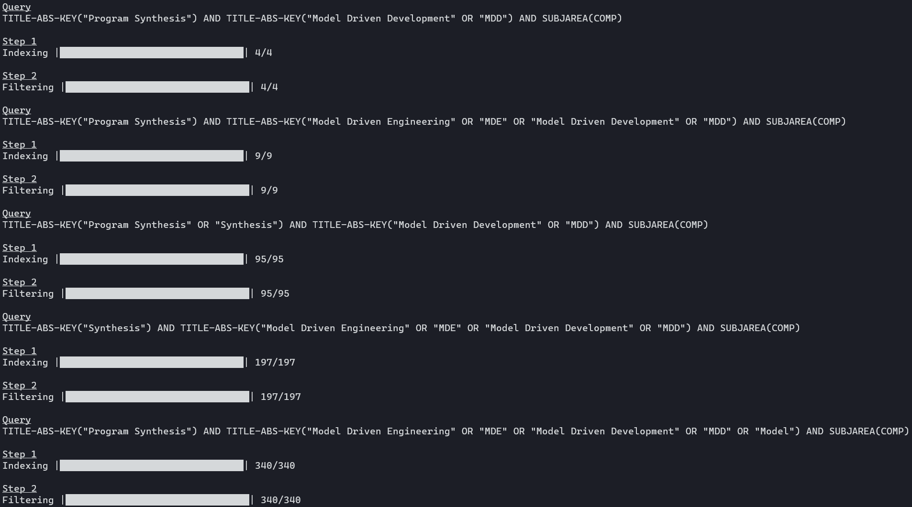

# scopus-search-api
SCOPUS Search API: This represents a search against the SCOPUS cluster, which contains SCOPUS abstracts. Scopus is the largest abstract and citation database of research literature and quality web sources. Updated daily, Scopus covers 50 million abstracts of over 20,500 peer-reviewed titles from more than 5,000 publishers. This search resource allows for the submission of Boolean queries into the Scopus index, retrieving relevant result metadata in a user-specific text formats.

